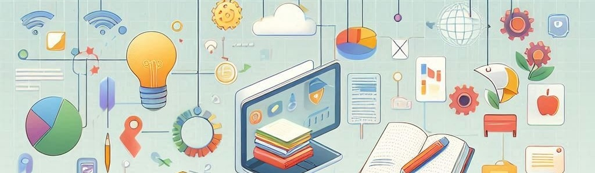

# Presentation

The **digital** and **information** society requires a deep understanding of the elements that enable a critical and safe life in this environment. **Computer** systems facilitate the creation of a more just and equitable society, promoting lifelong learning and personal development. The subject **Digitalization** responds to the need to adapt to a changing society, allowing students to actively participate in designing **creative** and accessible solutions from an inclusive perspective.

This course addresses the **digital** divide, the effects of computer use on **health** and **sustainability**, interpersonal relationships, and the ethical use of digital media. It also covers peaceful conflict resolution in virtual environments and civic engagement at local and global levels. The goal is to equip students with the tools for a fulfilling life project and provide meaningful learning experiences to face the challenges of the **21st century**, such as sustainability, well-being, and responsible digital culture.

The curriculum development follows the pedagogical principles of the **LOMLOE**, promoting critical reflection and independent work. The subject enhances **creativity** and reinforces self-esteem, **responsibility**, and oral, written, and audiovisual comprehension and expression. Moreover, its scientific-technical approach has significant implications for the use of **mathematics**.

The subject has a practical dimension, focusing on finding technical solutions to everyday challenges in a digitalized society. Students, individually or in teams, mobilize the necessary knowledge to solve digital projects. The competency-based approach involves interdisciplinary learning of knowledge, skills, and attitudes related to **engineering** and computer science. The competencies developed are assessed through specific evaluation criteria, and the learning situations encourage metacognitive reflection.

From Primary Education, students begin a process of digital literacy that deepens in Compulsory Secondary Education. The subject addresses how to establish healthy digital relationships, solve technological challenges, and design devices and networks while fostering a critical digital citizenship committed to well-being, equality, and sustainability.

The essential learnings are concretized in five specific competencies and four blocks of basic knowledge: digital devices, operating and communication systems, digitalization of the personal learning environment, digital security and well-being, and critical **digital** citizenship. The design of activities is based on the principles of universal design for learning to ensure full **inclusion**, and the evaluation criteria detail the expected level of competency development.