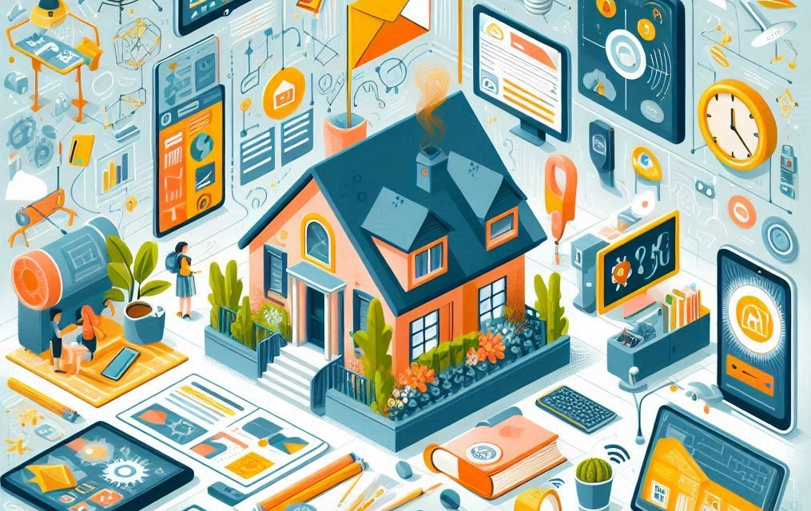

# 1.1. Smart Devices for Home and School

1.1. Personal computers, mobile devices, and other devices for domestic and educational use

In today's world, digital devices play a crucial role in both our daily lives and educational environments. Let's explore the various types of devices, their uses, and how they contribute to our learning and daily activities.

## Personal Computers

Personal computers (PCs) are perhaps the most versatile and powerful digital devices we use. They come in two main forms: desktops and laptops.

- **Desktops**: These are larger, stationary computers often used in homes and offices. Desktops have separate components, including a monitor, keyboard, mouse, and the central processing unit (CPU). They are powerful and can handle complex tasks such as video editing, gaming, and running multiple applications simultaneously.
  
- **Laptops**: These are portable computers that combine all the desktop components into one compact device. Laptops are widely used by students and professionals because of their portability. They are suitable for a range of activities, from writing essays and browsing the internet to creating presentations and coding.

## Mobile Devices

Mobile devices include smartphones and tablets, which are essential for on-the-go connectivity and convenience.

- **Smartphones**: These are handheld devices that combine the functionalities of a phone and a computer. Smartphones are incredibly versatile, allowing users to make calls, send messages, browse the internet, take photos, and use a wide variety of applications (apps). For students, smartphones can be useful for quick research, educational apps, and staying organized with calendars and reminders.
  
- **Tablets**: Tablets are larger than smartphones but smaller than laptops. They offer a balance between portability and functionality. Tablets are ideal for reading e-books, watching educational videos, drawing, and taking notes. They often come with touchscreens and can be paired with accessories like styluses and keyboards to enhance their usability.

## Other Devices for Domestic and Educational Use

Apart from PCs and mobile devices, there are other digital tools that are commonly used at home and in educational settings.

- **E-Readers**: These devices are specifically designed for reading digital books. They have screens that are easy on the eyes and can store thousands of books, making them convenient for avid readers and students who need access to numerous textbooks.
  
- **Smart Speakers**: Devices like Amazon Echo and Google Home can assist with a variety of tasks through voice commands. They can set reminders, answer questions, play music, and control other smart home devices. In educational contexts, they can help students with quick facts and language learning.
  
- **Wearables**: Smartwatches and fitness trackers are examples of wearables. They can monitor health metrics, send notifications, and even support some educational apps. For students, they can be useful for time management and staying active.

- **Interactive Whiteboards**: These are large, touch-sensitive screens used in classrooms to enhance teaching and learning. They allow teachers to display information dynamically and interactively, making lessons more engaging.

## Importance in Education

Digital devices have transformed education by providing access to vast resources and enabling interactive learning. They support various learning styles, facilitate collaboration, and offer personalized learning experiences. For example, students can use laptops to conduct research, participate in virtual classrooms using tablets, and use smartphones to stay connected with their peers and teachers.

In addition, digital devices prepare students for the future workforce, where digital literacy is a critical skill. By familiarizing themselves with these technologies, students can develop the necessary skills to succeed in a digital world.

## Conclusion

Personal computers, mobile devices, and other digital tools are integral to modern life and education. They provide numerous benefits, including increased access to information, enhanced learning experiences, and greater convenience in daily tasks. Understanding how to effectively use these devices is essential for both personal growth and academic success.

