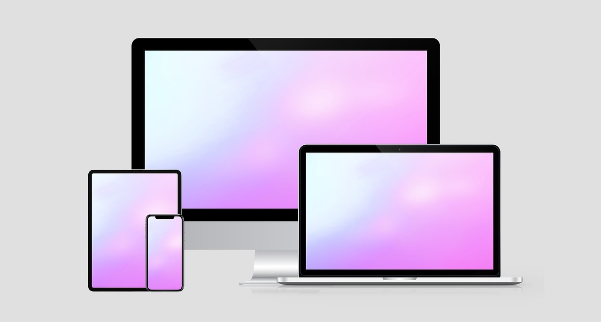

# Computer Science

## What is Computer Science?

Computer science is the study of computers and how they work. It helps us understand how computers are built (hardware) and how we make them do specific tasks (software). Computer science also looks at how computers can connect with each other through networks and the Internet. This connection lets computers share information all around the world.

We use computers to help us in many ways. For example, computers can play games, help us write stories, or find information online. Computer science teaches us how to make computers useful tools in our daily lives, whether at school, at home, or even in jobs someday.

## How We Use Computers

When we use a computer, there are three main steps. These steps help the computer turn our data, or information, into something useful for us.

1. **Data Input**: First, we need to give information, or data, to the computer. This step is called input. We might type words on a keyboard or use other devices to add data. For example, if we want to add a picture to the computer, we can use a scanner to scan the image or a digital camera to take a photo. These tools help put our data into the computer.

2. **Data Processing**: After we add data, the computer works with it. This is called processing. Processing means the computer saves, organizes, and changes the data to make it useful. For example, if we give the computer numbers, it can add them together. Or, if we add pictures, the computer might make them brighter or larger. Processing helps the computer understand our data and turn it into information we can use.

3. **Output Information**: After processing, the computer shows us the result, or output. Output is the information that we see after the computer has worked with our data. We might see the output on a screen, hear it as sound, or even print it on paper. For example, the computer might show us a photo we edited or a score from a game. Output is the final product that helps us use our data in a new way.

Learning computer science helps us understand these steps better. When we know how computers work, we can make them do even more amazing things!