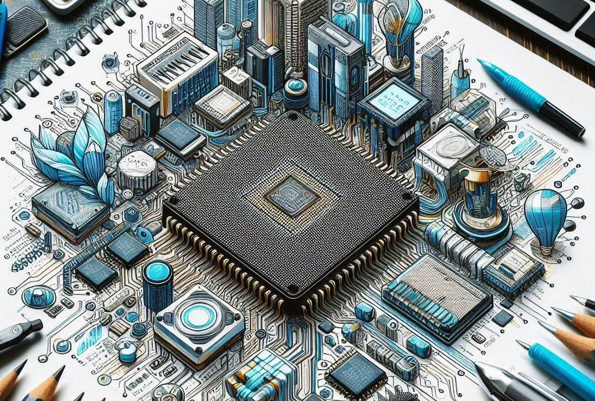

# Central Processing Unit (CPU)

The Central Processing Unit, or CPU, is often called the brain of a digital device. It performs calculations and carries out instructions to make the device work. Without the CPU, your computer, tablet, or smartphone wouldn't be able to do anything useful. Let's delve deeper into what makes the CPU so crucial and how it operates.

## Key points

**Brain of the Device:**  
The CPU processes instructions from programs and applications. Just like our brains control our actions, the CPU controls the functions of a digital device. Every action you take on a device, whether it’s opening an app, playing a game, or typing a document, is processed by the CPU. It translates human actions (like clicking a mouse) into actions the device can perform.

**Speed:**  
CPU speed is measured in gigahertz (GHz). A higher number means a faster CPU. For example, a 3.5 GHz CPU can perform 3.5 billion cycles per second. These cycles are like tiny steps in processing information. The more cycles per second, the more instructions the CPU can handle, leading to faster performance. This speed impacts how quickly your device can open programs, run applications, and execute commands.

**Cores:**  
Modern CPUs have multiple cores. More cores allow a device to perform multiple tasks at the same time. Initially, CPUs had a single core, meaning they could handle one task at a time. However, most modern CPUs are multicore, with dual-core, quad-core, and even octa-core processors being common. Each core can handle its own tasks, making multitasking smoother and more efficient. For instance, while one core handles a game you’re playing, another core can manage background tasks like checking for email updates.

## How the CPU Works

To understand the CPU better, let's break down its main functions:

1. **Fetch:** The CPU gets the next instruction from the device's RAM (Random Access Memory).
2. **Decode:** It then decodes the instruction to understand what action is needed.
3. **Execute:** The CPU performs the instruction, whether it’s a calculation, data transfer, or something else.
4. **Store:** Finally, the CPU writes the result back to the RAM or a register (a small storage location within the CPU).

## Real-World Analogy

Think of the CPU like a teacher in a classroom. The teacher gives instructions to students (the device's other parts) to complete tasks. A faster teacher (higher GHz) and more teachers (more cores) mean tasks are done quicker and more efficiently. If the teacher can instruct faster, students complete their work faster. If there are multiple teachers, more students can receive instructions simultaneously, improving overall efficiency.

## Importance of CPU in Everyday Use:

In your daily use of digital devices, the CPU plays a critical role. When you launch a web browser, the CPU fetches, decodes, and executes the necessary instructions to display the web page. When you play a game, the CPU handles complex calculations to render graphics, process game logic, and respond to your inputs. Even simple tasks like typing a document or watching a video rely on the CPU to function smoothly.

A powerful CPU can significantly enhance your experience by reducing lag, improving load times, and allowing for more complex applications to run seamlessly. As technology advances, CPUs continue to evolve, becoming more powerful and efficient, which in turn makes our devices more capable and responsive.

Understanding the CPU's role helps you appreciate why certain devices perform better than others and why upgrading your CPU can lead to noticeable improvements in performance.