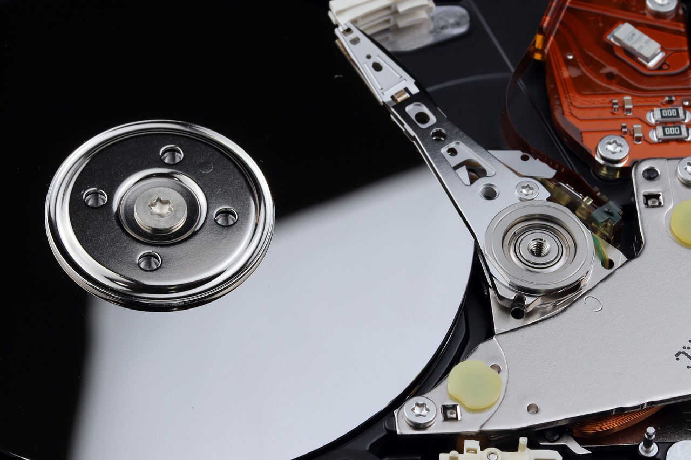

# Computer Main Components

Computers have many important parts, or *components*, that work together to help us do tasks like playing games, writing stories, or browsing the Internet. Let’s look at some of these parts and what they do!

## Motherboard

The motherboard is like the main road where all the important parts of the computer are connected. It’s a large board inside the computer that connects things like the CPU, memory, and hard drive. We also call it the “mainboard” or “logic board.”

All the other parts of the computer communicate through the motherboard, which makes it very important for everything to work well together.

## CPU (Central Processing Unit)

The CPU, or Central Processing Unit, is known as the “brain” of the computer.

The CPU takes care of most of the thinking and calculations. When you play a game, type on the keyboard, or open a file, the CPU processes all these actions to make sure they happen correctly.

It follows instructions given by the software and tells other parts of the computer what to do. Without the CPU, the computer wouldn’t be able to work!

## ROM (Read Only Memory)

ROM, or Read Only Memory, is a type of memory in the computer. The information stored in ROM cannot be changed, and it is not erased even when we turn off the computer.

ROM stores important instructions that help the computer start up and check that everything is working. Since the content stays even after the power is off, ROM is very reliable for keeping essential data.

## RAM (Random Access Memory)

RAM, or Random Access Memory, is a different type of memory. Unlike ROM, it’s called read-write memory, which means the information in RAM can be changed.

RAM is where the computer keeps data temporarily while you’re using it, like when you’re playing a game or typing a document. However, RAM is erased every time we turn off the computer, so anything stored here is only kept while the computer is on. This makes RAM very fast, and it helps the CPU work quickly with data.

## Hard Drives

The hard drive (or hard disk) is where the computer stores all of its data, including programs, files, and photos.

The hard drive keeps information even after the computer is turned off, so it is very good for storing things we want to save, like our homework or music files. Hard drives can hold a lot of information, and unlike RAM, they keep it safe even when the computer isn’t powered on.

## How They Work Together

When you use a computer, these parts all work together. For example, when you open a game, the CPU (the computer’s brain) uses RAM to load the game quickly. While you play, the CPU keeps reading and writing data in the RAM because RAM is fast. If you save your game progress, the information goes from the RAM to the hard drive, where it will stay even after you turn off the computer. This way, you can continue from where you left off next time. 

So, the CPU, RAM, and hard drive work as a team: the CPU processes information, the RAM holds it temporarily, and the hard drive saves it for later. Together, they make the computer a powerful tool!