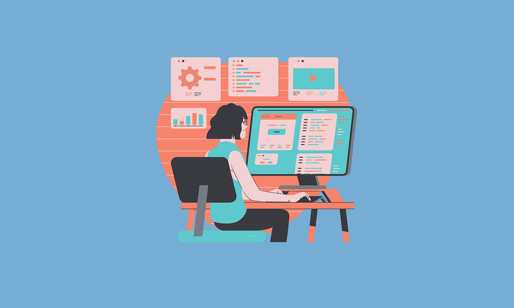

# Common Operating Systems and Applications

In this section, we are going to learn about *operating systems* and *applications*. Both of these are types of software that help computers, smartphones, and tablets work properly. Understanding these basic ideas will help you use digital devices better and know how they function.

Computers, smartphones, and tablets need software to run. There are two main types of software:

1. **Operating Systems (OS)**  
   An *Operating System* is the main program that controls everything in the computer or mobile device. It helps the device start up, manages other programs, and makes sure all parts of the device work together. Without an operating system, the computer or device would not work.

2. **Applications (Apps)**  
   An *Application* is a program that allows us to do specific tasks on a device. Applications are also called “apps” for short. Some apps are for writing, some are for playing games, and others are for learning. Apps help us do things like take notes, draw, or even chat with friends online.

Operating systems and applications work together to make computers and mobile devices easy to use. The operating system manages everything on the device, while applications let you do specific tasks, like writing, creating presentations, or browsing the web. Knowing about different operating systems and apps helps you use your device effectively and explore more ways to learn and stay organized.