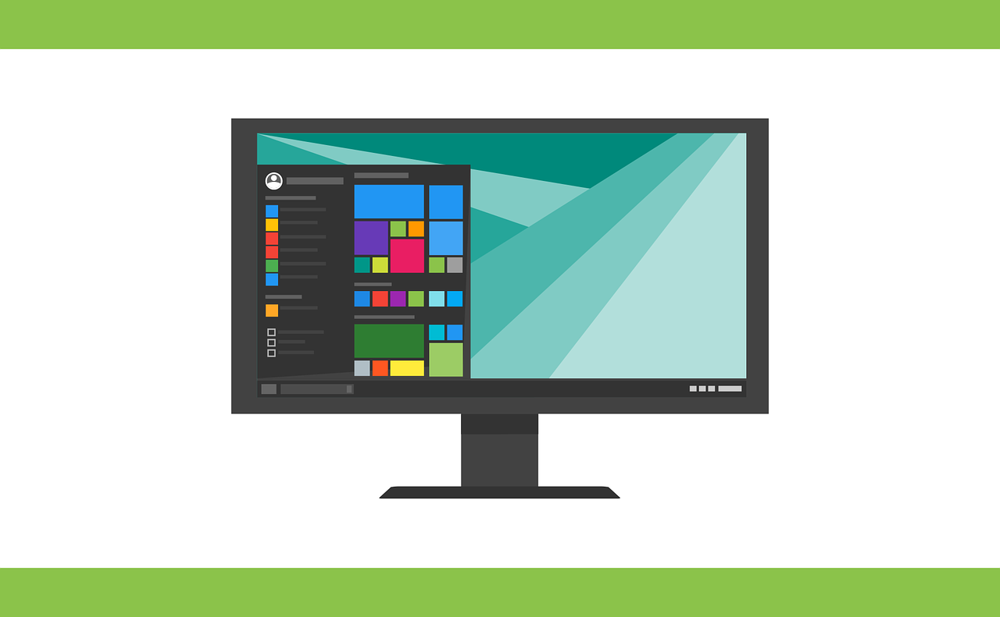

# Operating Systems

An *Operating System* is like the “brain” of a computer or mobile device. It helps the device start, controls how it works, and makes sure everything runs smoothly. There are different types of operating systems for computers, smartphones, and tablets. Let’s look at some common operating systems.

## Microsoft Windows

Windows is an operating system made by Microsoft. It is very popular for computers and laptops. Many people use Windows for school, work, and playing games. Windows has a user-friendly interface, which means it is easy to use. It uses icons and a taskbar to help people find and open programs.

The latest versions of Windows are Windows 10 and Windows 11. Windows is good for running many types of applications, including those for studying, creating documents, or even designing.

## macOS

macOS is an operating system made by Apple. It runs on Apple’s computers, which are called Macs. Many people like macOS because it is fast and smooth. It also has a design that is very visually appealing. Like Windows, macOS has a taskbar and icons for easy navigation.

macOS is used by people who need powerful applications for creative work, such as graphic design, music, and video editing. The latest versions of macOS are named after California places, like macOS Monterey and macOS Ventura.

## Linux

Linux is another operating system used on some computers. It is popular with people who like to learn more about how computers work because it can be customized a lot. Unlike Windows and macOS, Linux is free to use.

It is used by schools, universities, and people interested in programming. There are many versions, or “distributions,” of Linux, such as Ubuntu, Fedora, and Mint.

## Mobile Operating Systems

   - **iOS**: This is the operating system used by iPhones and iPads, which are made by Apple. iOS is known for its smooth, simple design and is very popular worldwide. iOS has a large number of apps available in the App Store, which makes it very versatile.
   - **Android**: Android is another mobile operating system, but it is used by many different brands of smartphones and tablets, like Samsung, LG, and Google Pixel. Android is known for its flexibility and the ability to be customized. The Google Play Store has a huge number of apps available for Android devices.
