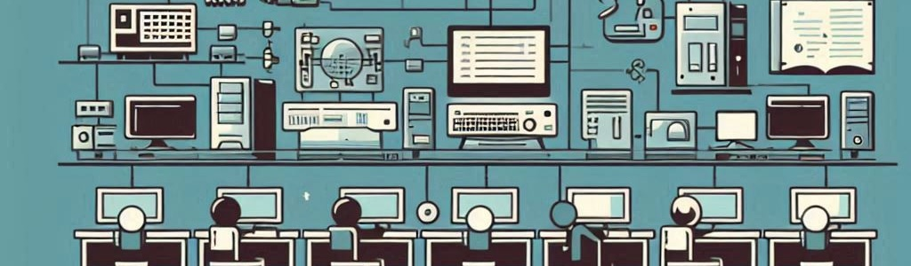

# Unit 1. Inside the Machine: Computer Architecture and Operating Systems¶

## Summary

The unit Inside the Machine: Computer Architecture and Operating Systems offers a comprehensive exploration of the structure and functioning of computers. It delves into the digital representation of information and measurement units, details the design and components of a personal computer, and provides criteria for selecting and configuring these components. Additionally, it addresses a critical approach to the responsible and sustainable use of computing equipment. The unit includes the interaction between components to optimize performance and efficiency, and examines the features of mobile devices. It also covers operating systems, their installation, and application management.
