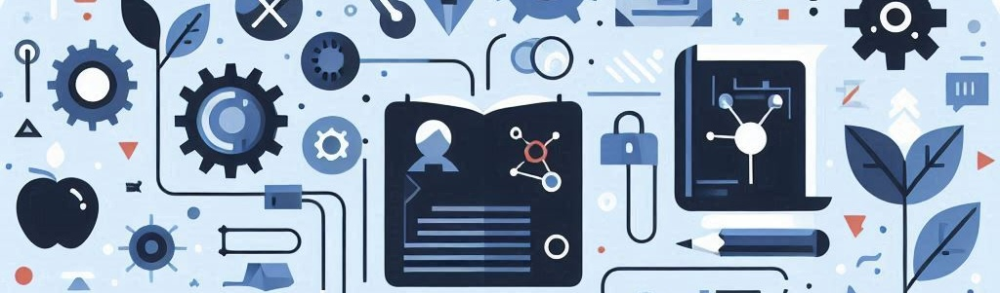

# Unit 3. Creating the Future: Digital Content and Coding Essentials

The unit *Creating the Future: Digital Content and Coding Essentials* provides comprehensive training in digital content creation and management, as well as programming. It begins with effective web information searching, emphasizing the importance of accuracy and intellectual property. It then addresses organizing the digital environment, including file management and workspace customization. The unit delves into digital content creation, covering everything from aesthetics and audiovisual language to the use of office and multimedia tools. Finally, it introduces basic programming concepts, application development for various devices, and the integration of artificial intelligence.