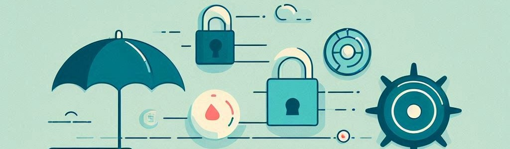

# Unit 5. Security and Well-being in Digital Spaces

The unit *Security and Well-being in Digital Spaces* addresses security and well-being in the digital environment. It examines the safe use of devices and data, including security tools and measures to prevent and mitigate risks and attacks. It focuses on managing digital identity and protecting privacy, with an emphasis on social media settings and personal data protection. Additionally, it promotes physical health through ergonomic practices and addresses the environmental impact of digital devices. The unit includes strategies to protect against online violence and maintain digital well-being.