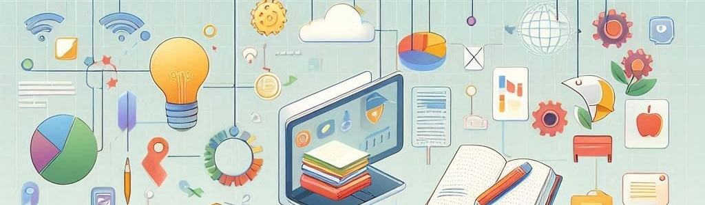

# Information & Communication Technologies

The subject **Information and Communication Technologies** equips students with the skills needed to thrive in a digital and information-based society. It emphasizes the responsible and sustainable use of **computer** systems, promoting lifelong learning and personal development. The course addresses key topics such as the **digital** divide, the impact of digital media on **health** and **sustainability**, interpersonal relationships, and the ethical use of technology. It also focuses on conflict resolution in virtual environments and encourages civic engagement on both local and global levels.

The curriculum fosters critical thinking, independent work, **creativity**, and strengthens self-esteem, **responsibility**, and communication skills. The course has a strong practical component, emphasizing the application of knowledge to solve real-world digital challenges, individually or in teams. It incorporates interdisciplinary learning related to **engineering** and computer science, with specific evaluation criteria assessing competency development.

Starting from Primary Education and continuing through Secondary Education, the subject deepens students' digital literacy, focusing on healthy digital relationships, technological problem-solving, and network design. It aims to cultivate a critical digital citizenship committed to **well-being**, equality, and sustainability. Activities are designed to ensure full **inclusion**, following the principles of universal design for learning, and the curriculum is structured around five key competencies and four basic knowledge blocks.

